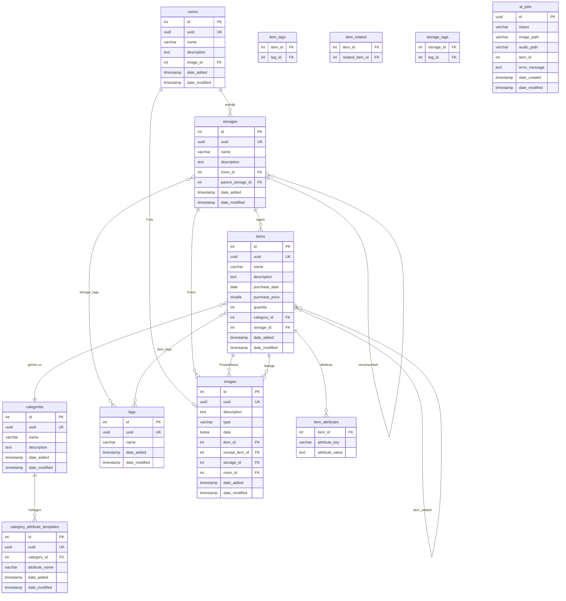
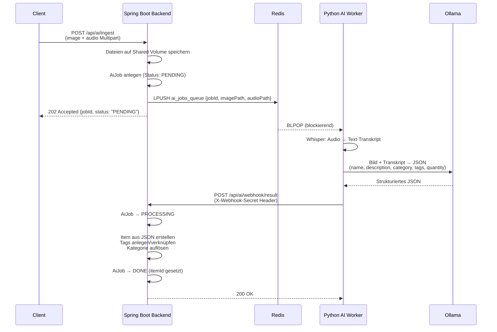

# Kistogramm

Kistogramm ist eine Heiminventar-Verwaltungsanwendung. Sie hilft dabei, Gegenstände in Räumen und Aufbewahrungsorten zu organisieren, zu kategorisieren und schnell wiederzufinden. Zusätzlich bietet sie eine KI-gestützte Erfassung: per Foto und Sprachbeschreibung werden Gegenstände automatisch erkannt und ins Inventar aufgenommen.

## Inhaltsverzeichnis

- [Features](#features)
- [Systemarchitektur](#systemarchitektur)
- [Datenmodell](#datenmodell)
- [KI-Ingestion-Pipeline](#ki-ingestion-pipeline)
- [API-Referenz](#api-referenz)
- [Deployment](#deployment)
- [Entwicklung](#entwicklung)

---

## Features

- **Räume & Lagerorte** – Hierarchische Struktur: Räume enthalten Lagerorte, Lagerorte können verschachtelt werden (z. B. Regal → Fach → Box).
- **Gegenstände** – Detaillierte Erfassung mit Name, Beschreibung, Kaufdatum, Kaufpreis, Menge, Kategorie, Tags, Fotos und Kassenbelegen.
- **Kategorien & Attributvorlagen** – Benutzerdefinierte Kategorien mit typspezifischen Attributen (z. B. Kleidung → Größe, Lebensmittel → MHD).
- **Tags** – Freie Verschlagwortung von Gegenständen und Lagerorten.
- **Volltext-UUID-Suche** – Beliebige Entitäten per QR-Code / UUID direkt auffinden.
- **Export & Import** – Komplettes Inventar als ZIP-Archiv exportieren und importieren.
- **KI-Erfassung** – Foto + Sprachaufnahme einreichen; das System erkennt den Gegenstand automatisch und legt einen Eintrag an.

---

## Systemarchitektur

```
┌─────────────────────────────────────────────────────────────┐
│                         Client                              │
│                  (Browser / Mobile App)                     │
└────────────────────────┬────────────────────────────────────┘
                         │ HTTP REST
                         ▼
┌─────────────────────────────────────────────────────────────┐
│                  Spring Boot Backend                        │
│                  Java 25 · Port 8080                        │
│                                                             │
│  Controllers → Services → Repositories → JPA Entities      │
│                                                             │
│  • REST API (OpenAPI / Swagger UI: /swagger-ui.html)        │
│  • Flyway-Datenbankmigrationen                              │
│  • AI-Queue-Service                                         │
└────────┬──────────────────────────────┬─────────────────────┘
         │ JDBC                         │ Redis LPUSH
         ▼                              ▼
┌─────────────────┐          ┌──────────────────────┐
│   PostgreSQL    │          │        Redis          │
│   (Produktion)  │          │   Queue: ai_jobs_queue│
│   H2 (Dev)      │          └──────────┬───────────┘
└─────────────────┘                     │ BLPOP
                                        ▼
                            ┌───────────────────────┐
                            │     Python AI Worker  │
                            │                       │
                            │  1. Faster-Whisper    │
                            │     (Sprache → Text)  │
                            │  2. Ollama VLM        │
                            │     (Bild-Analyse)    │
                            └──────────┬────────────┘
                                       │ HTTP POST (Webhook)
                                       ▼
                            POST /api/ai/webhook/result
                            (Spring Boot erstellt Item)
```

### Komponenten

| Komponente | Technologie | Zweck |
|---|---|---|
| Backend | Spring Boot 3.5, Java 25 | REST API, Businesslogik, DB-Zugriff |
| Datenbank | PostgreSQL 16 (Prod), H2 (Dev) | Persistenz |
| Message Queue | Redis 7 | Asynchrone Job-Übergabe an den AI Worker |
| AI Worker | Python, faster-whisper, Ollama | Spracherkennung + Bilderkennung |
| Uploads | Shared Volume `/uploads` | Temporäre Speicherung von Bild- und Audiodateien |

---

## Datenmodell

### Entitäten-Übersicht



### Beziehungen im Detail

| Beziehung | Typ | Beschreibung |
|---|---|---|
| Room → Storage | 1:N | Ein Raum enthält beliebig viele Lagerorte |
| Storage → Storage | 1:N (self) | Lagerorte können beliebig tief verschachtelt werden |
| Storage → Item | 1:N | Ein Lagerort enthält beliebig viele Gegenstände |
| Item → Category | N:1 | Jeder Gegenstand gehört zu einer Kategorie |
| Item ↔ Tag | M:N | Gegenstände und Lagerorte können mehrere Tags haben |
| Item ↔ Item | M:N (self) | Verwandte Gegenstände (bidirektional) |
| Item → Image | 1:N | Produktfotos und Kassenbelege getrennt gespeichert |
| Category → AttributeTemplate | 1:N | Pro Kategorie definierte Pflichtfelder |
| Item → item_attributes | 1:N (Map) | Dynamische Schlüssel-Wert-Attribute pro Gegenstand |

### Standardkategorien

Beim ersten Start werden folgende Kategorien automatisch angelegt:

| Kategorie | Attributvorlagen |
|---|---|
| Elektronik | – |
| Kleidung | Größe, Zuletzt getragen |
| Lebensmittel | MHD |
| Möbelstück | – |
| Pflanze | – |

---

## KI-Ingestion-Pipeline

Die KI-Pipeline ermöglicht die automatische Erfassung von Gegenständen per Foto und Sprachbeschreibung.

### Ablauf



### Job-Status

| Status | Bedeutung |
|---|---|
| `PENDING` | Job in der Queue, noch nicht verarbeitet |
| `PROCESSING` | Worker hat Ergebnis gesendet, Item wird angelegt |
| `DONE` | Item erfolgreich angelegt |
| `FAILED` | Verarbeitung fehlgeschlagen (Fehlermeldung in `error_message`) |

### KI-Modelle

| Aufgabe | Modell | Beschreibung |
|---|---|---|
| Spracherkennung | `faster-whisper` (base, CPU) | Audio-Datei → Text-Transkript |
| Bilderkennung | `qwen2.5vl:7b` via Ollama | Bild + Transkript → strukturiertes Inventar-JSON |

Der VLM-Prompt extrahiert: `name`, `description`, `category` (aus vorgegebener Liste), `tags` (3–5 Stück), `quantity`, `purchase_price`.

---

## API-Referenz

Die vollständige interaktive API-Dokumentation ist unter `/swagger-ui.html` verfügbar (Springdoc OpenAPI).

### Räume `/api/rooms`

| Methode | Pfad | Beschreibung |
|---|---|---|
| `GET` | `/api/rooms` | Alle Räume abrufen |
| `GET` | `/api/rooms/{id}` | Raum nach ID |
| `POST` | `/api/rooms` | Raum erstellen |
| `PUT` | `/api/rooms/{id}` | Raum aktualisieren |
| `DELETE` | `/api/rooms/{id}` | Raum löschen |
| `GET` | `/api/rooms/{id}/storages` | Lagerorte eines Raums |
| `GET` | `/api/rooms/{id}/items` | Alle Gegenstände in einem Raum |
| `GET` | `/api/rooms/{id}/image` | Raumfoto abrufen |
| `POST` | `/api/rooms/{id}/image` | Raumfoto hochladen |
| `DELETE` | `/api/rooms/{id}/image` | Raumfoto löschen |

### Lagerorte `/api/storages`

| Methode | Pfad | Beschreibung |
|---|---|---|
| `GET` | `/api/storages` | Alle Lagerorte abrufen |
| `GET` | `/api/storages/{id}` | Lagerort nach ID |
| `POST` | `/api/storages` | Lagerort erstellen |
| `PUT` | `/api/storages/{id}` | Lagerort aktualisieren |
| `DELETE` | `/api/storages/{id}` | Lagerort löschen |
| `GET` | `/api/storages/{id}/images` | Fotos des Lagerorts |
| `GET` | `/api/storages/{id}/images/{imageId}` | Einzelnes Foto |
| `POST` | `/api/storages/{id}/images` | Fotos hochladen (Multipart) |
| `DELETE` | `/api/storages/{id}/images/{imageId}` | Einzelnes Foto löschen |
| `DELETE` | `/api/storages/{id}/images` | Alle Fotos löschen |

### Gegenstände `/api/items`

| Methode | Pfad | Beschreibung |
|---|---|---|
| `GET` | `/api/items` | Alle Gegenstände abrufen |
| `GET` | `/api/items/{id}` | Gegenstand nach ID |
| `POST` | `/api/items` | Gegenstand erstellen |
| `PUT` | `/api/items/{id}` | Gegenstand aktualisieren |
| `DELETE` | `/api/items/{id}` | Gegenstand löschen |
| `PUT` | `/api/items/{id}/tags` | Tags eines Gegenstands setzen |
| `PUT` | `/api/items/{id}/related` | Verwandte Gegenstände verknüpfen |
| `GET` | `/api/items/{id}/images` | Produktfotos abrufen |
| `POST` | `/api/items/{id}/images` | Produktfotos hochladen (Multipart) |
| `DELETE` | `/api/items/{id}/images` | Alle Produktfotos löschen |
| `DELETE` | `/api/items/{id}/images/{imageId}` | Einzelnes Produktfoto löschen |
| `GET` | `/api/items/{id}/receipts` | Kassenbelege abrufen |
| `POST` | `/api/items/{id}/receipts` | Kassenbelege hochladen (Multipart) |
| `DELETE` | `/api/items/{id}/receipts` | Alle Kassenbelege löschen |
| `DELETE` | `/api/items/{id}/receipts/{receiptId}` | Einzelnen Kassenbeleg löschen |

**Item-Objekt (JSON):**
```json
{
  "id": 1,
  "uuid": "550e8400-e29b-41d4-a716-446655440000",
  "name": "Bohrmaschine",
  "description": "Akkubohrmaschine 18V",
  "purchaseDate": "2023-05-15",
  "purchasePrice": 89.99,
  "quantity": 1,
  "categoryId": 2,
  "storageId": 5,
  "tagIds": [3, 7],
  "relatedItemIds": [12],
  "customAttributes": { "Akkutyp": "18V Li-Ion" },
  "dateAdded": "2024-01-10T14:30:00",
  "dateModified": "2024-01-10T14:30:00"
}
```

### Kategorien `/api/categories`

| Methode | Pfad | Beschreibung |
|---|---|---|
| `GET` | `/api/categories` | Alle Kategorien |
| `GET` | `/api/categories/{id}` | Kategorie nach ID |
| `POST` | `/api/categories` | Kategorie erstellen |
| `PUT` | `/api/categories/{id}` | Kategorie aktualisieren |
| `DELETE` | `/api/categories/{id}` | Kategorie löschen |
| `GET` | `/api/categories/{id}/items` | Gegenstände einer Kategorie |
| `GET` | `/api/categories/template/category/{id}` | Attributvorlagen einer Kategorie |
| `POST` | `/api/categories/template` | Attributvorlage erstellen |
| `DELETE` | `/api/categories/template/{id}` | Attributvorlage löschen |

### Tags `/api/tags`

| Methode | Pfad | Beschreibung |
|---|---|---|
| `GET` | `/api/tags` | Alle Tags |
| `GET` | `/api/tags/{id}` | Tag nach ID |
| `POST` | `/api/tags` | Tag erstellen |
| `PUT` | `/api/tags/{id}` | Tag aktualisieren |
| `DELETE` | `/api/tags/{id}` | Tag löschen |
| `GET` | `/api/tags/{id}/items` | Gegenstände mit diesem Tag |

### Suche `/api/search`

| Methode | Pfad | Beschreibung |
|---|---|---|
| `GET` | `/api/search/{uuid}` | Entität per UUID suchen (optional: `?type=item\|room\|storage\|tag`) |

Gibt das passende Objekt zurück, unabhängig vom Typ – ideal für QR-Code-Scanning.

### Export & Import

| Methode | Pfad | Beschreibung |
|---|---|---|
| `GET` | `/api/export` | Vollständiges Inventar als ZIP-Archiv herunterladen |
| `POST` | `/api/import` | ZIP-Archiv importieren |

Import-Parameter:
- `file` – ZIP-Archiv (Multipart)
- `overwrite` (optional, default `false`) – Existierende Einträge überschreiben
- `failOnError` (optional, default `true`) – Bei Fehler abbrechen und rollbacken

### KI-Ingestion `/api/ai`

| Methode | Pfad | Beschreibung |
|---|---|---|
| `POST` | `/api/ai/ingest` | KI-Job einreichen (Multipart: `image`, `audio`) |
| `POST` | `/api/ai/webhook/result` | Webhook für den AI Worker (intern, erfordert `X-Webhook-Secret`) |

**Ingest-Response:**
```json
{
  "jobId": "550e8400-e29b-41d4-a716-446655440000",
  "status": "PENDING"
}
```

---

## Deployment

### Voraussetzungen

- Docker & Docker Compose
- Ollama lokal installiert und erreichbar unter `http://localhost:11434`
- VLM-Modell geladen: `ollama pull qwen2.5vl:7b`

### Starten

```bash
# Webhook-Secret setzen (optional, Standard: "change-me-in-production")
export WEBHOOK_SECRET=mein-geheimes-secret

docker compose up -d
```

Die Anwendung ist anschließend unter `http://localhost:8080` erreichbar.  
Swagger UI: `http://localhost:8080/swagger-ui.html`

### Docker-Services

| Service | Image | Port | Beschreibung |
|---|---|---|---|
| `app` | Lokaler Build | 8080 | Spring Boot Backend |
| `db` | `postgres:16` | 5432 | PostgreSQL Datenbank |
| `redis` | `redis:7-alpine` | – | Message Queue |
| `ai-worker` | Lokaler Build (`./ai-worker`) | – | Python AI Worker |

### Umgebungsvariablen (Backend)

| Variable | Standard | Beschreibung |
|---|---|---|
| `SPRING_PROFILES_ACTIVE` | `prod` | Spring-Profil (`dev` oder `prod`) |
| `SPRING_DATASOURCE_URL` | – | JDBC-URL der PostgreSQL-Datenbank |
| `SPRING_DATASOURCE_USERNAME` | – | Datenbankbenutzer |
| `SPRING_DATASOURCE_PASSWORD` | – | Datenbankpasswort |
| `AI_UPLOAD_DIR` | `/uploads` | Verzeichnis für temporäre KI-Uploads |
| `AI_WEBHOOK_SECRET` | `change-me-in-production` | Shared Secret für den Worker-Webhook |

### Umgebungsvariablen (AI Worker)

| Variable | Standard | Beschreibung |
|---|---|---|
| `REDIS_HOST` | `redis` | Redis-Hostname |
| `REDIS_PORT` | `6379` | Redis-Port |
| `CALLBACK_URL` | – | Webhook-URL des Backends |
| `WEBHOOK_SECRET` | – | Shared Secret (muss mit Backend übereinstimmen) |
| `OLLAMA_HOST` | `http://host.docker.internal:11434` | Ollama-Endpunkt |
| `VLM_MODEL` | `qwen2.5vl:7b` | Zu verwendendes VLM-Modell |

---

## Entwicklung

### Lokaler Start (Dev-Profil)

Im Dev-Profil wird eine eingebettete H2-Datenbank verwendet – kein Docker erforderlich.

```bash
./mvnw spring-boot:run -Pdev
```

### Tests ausführen

```bash
./mvnw test
```

Tests verwenden H2 und benötigen keine laufende Infrastruktur.

### Build (Produktion)

```bash
./mvnw package -Pprod -DskipTests
```

### Technologie-Stack

| Schicht | Technologie |
|---|---|
| Sprache (Backend) | Java 25 |
| Framework | Spring Boot 3.5 |
| Persistenz | Spring Data JPA, Flyway |
| Datenbank (Prod) | PostgreSQL 16 |
| Datenbank (Dev/Test) | H2 |
| Message Queue | Redis (Spring Data Redis) |
| Mapping | MapStruct 1.6 |
| API-Dokumentation | SpringDoc OpenAPI 2 (Swagger UI) |
| Sprache (AI Worker) | Python 3 |
| Spracherkennung | faster-whisper |
| Bilderkennung | Ollama (lokales VLM) |
| Containerisierung | Docker, Docker Compose |
