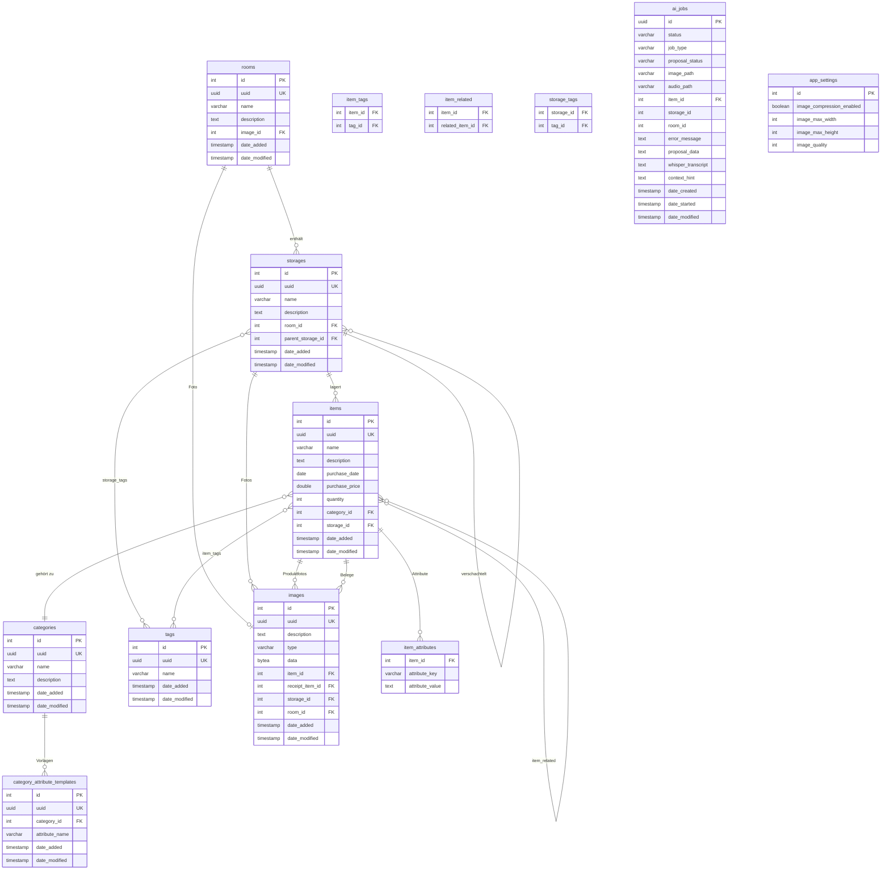
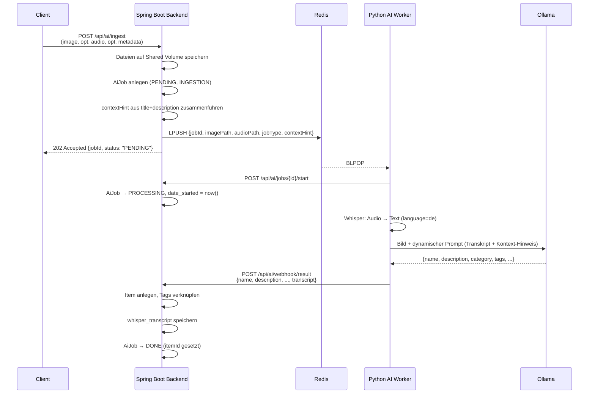
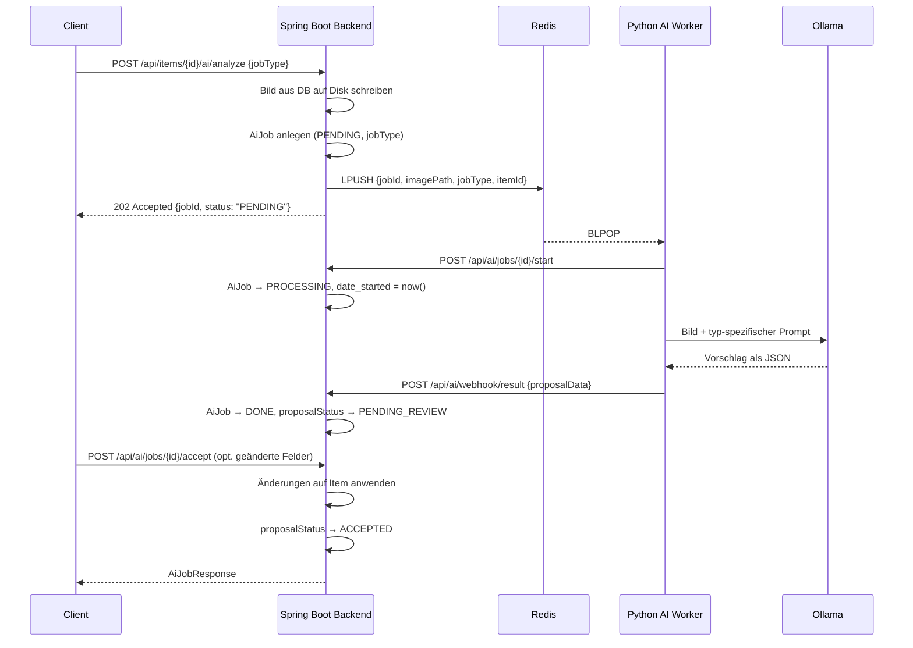

# Kistogramm

Kistogramm ist eine Heiminventar-Verwaltungsanwendung. Sie hilft dabei, Gegenstände in Räumen und Aufbewahrungsorten zu organisieren, zu kategorisieren und schnell wiederzufinden. Zusätzlich bietet sie eine KI-gestützte Erfassung und Analyse: per Foto und Sprachbeschreibung werden Gegenstände automatisch erkannt und ins Inventar aufgenommen; für bestehende Gegenstände können Maße, Wert, Zustand und Tags per KI geschätzt werden.

## Inhaltsverzeichnis

- [Features](#features)
- [Systemarchitektur](#systemarchitektur)
- [Datenmodell](#datenmodell)
- [KI-Pipeline](#ki-pipeline)
- [API-Referenz](#api-referenz)
- [Monitor](#monitor)
- [Deployment](#deployment)
- [Entwicklung](#entwicklung)

---

## Features

- **Räume & Lagerorte** – Hierarchische Struktur: Räume enthalten Lagerorte, Lagerorte können verschachtelt werden (z. B. Regal → Fach → Box).
- **Gegenstände** – Detaillierte Erfassung mit Name, Beschreibung, Kaufdatum, Kaufpreis, Menge, Kategorie, Tags, Fotos und Kassenbelegen.
- **Kategorien & Attributvorlagen** – Benutzerdefinierte Kategorien mit typspezifischen Attributen (z. B. Kleidung → Größe, Lebensmittel → MHD).
- **Tags** – Freie Verschlagwortung von Gegenständen und Lagerorten.
- **Volltext-UUID-Suche** – Beliebige Entitäten per QR-Code / UUID direkt auffinden.
- **Export & Import** – Komplettes Inventar als ZIP-Archiv exportieren und importieren.
- **Bildkomprimierung** – Hochgeladene Bilder werden serverseitig komprimiert (konfigurierbar via `/api/settings`).
- **KI-Erfassung (Ingestion)** – Foto + optionale Sprachaufnahme + optionaler Text-Hinweis einreichen; das System erkennt den Gegenstand automatisch und legt einen Eintrag an.
- **KI-Analyse-Jobs** – Für bestehende Gegenstände können per KI Vorschläge für Maße, Marktwert, Zustand und Tags erstellt werden. Vorschläge müssen vor der Übernahme bestätigt werden.
- **Monitor-Dashboard** – Web-basiertes Admin-Dashboard (Port 8888) mit Systemstatus, Job-Übersicht mit Vorschaubildern, Audio-Player, Whisper-Transkripten und Verarbeitungsdauer.

---

## Systemarchitektur

```
┌─────────────────────────────────────────────────────────────┐
│                         Client                              │
│                  (Browser / Mobile App)                     │
└────────────────────────┬────────────────────────────────────┘
                         │ HTTP REST
                         ▼
┌─────────────────────────────────────────────────────────────┐
│                  Spring Boot Backend                        │
│                  Java 25 · Port 8080                        │
│                                                             │
│  Controllers → Services → Repositories → JPA Entities      │
│                                                             │
│  • REST API (OpenAPI / Swagger UI: /swagger-ui.html)        │
│  • Flyway-Datenbankmigrationen (V1–V8)                      │
│  • AI-Queue-Service & AI-Job-Service                        │
└────────┬──────────────────────────────┬─────────────────────┘
         │ JDBC                         │ Redis LPUSH
         ▼                              ▼
┌─────────────────┐          ┌──────────────────────┐
│   PostgreSQL    │          │        Redis          │
│   (Produktion)  │          │   Queue: ai_jobs_queue│
│   H2 (Dev)      │          └──────────┬───────────┘
└─────────────────┘                     │ BLPOP
                                        ▼
                            ┌───────────────────────┐
                            │     Python AI Worker  │
                            │                       │
                            │  1. POST .../start    │
                            │  2. Faster-Whisper    │
                            │     (Sprache → Text)  │
                            │  3. Ollama VLM        │
                            │     (Bild-Analyse)    │
                            └──────────┬────────────┘
                                       │ HTTP POST (Webhook)
                                       ▼
                            POST /api/ai/webhook/result

┌─────────────────────────────────────────────────────────────┐
│              Monitor-Dashboard · Port 8888                  │
│  Python (FastAPI) · Proxy für Backend-Jobs-API              │
│  • Systemstatus, Metriken, Container-Stats                  │
│  • Job-Übersicht: Vorschaubilder, Whisper-Transkript,       │
│    Kontext-Hinweis, Verarbeitungsdauer                      │
│  • Audio-Player, Log-Streaming (SSE)                        │
│  • Bulk-Delete-Buttons                                      │
└─────────────────────────────────────────────────────────────┘
```

### Komponenten

| Komponente | Technologie | Zweck |
|---|---|---|
| Backend | Spring Boot 3.5, Java 25 | REST API, Businesslogik, DB-Zugriff |
| Datenbank | PostgreSQL 16 (Prod), H2 (Dev) | Persistenz |
| Message Queue | Redis 7 | Asynchrone Job-Übergabe an den AI Worker |
| AI Worker | Python, faster-whisper, Ollama | Spracherkennung + Bilderkennung |
| Monitor | Python, FastAPI | Admin-Dashboard, Job-Debugging |
| Uploads | Shared Volume `/uploads` | Temporäre Speicherung von Bild- und Audiodateien |

---

## Datenmodell

### Entitäten-Übersicht



### Beziehungen im Detail

| Beziehung | Typ | Beschreibung |
|---|---|---|
| Room → Storage | 1:N | Ein Raum enthält beliebig viele Lagerorte |
| Storage → Storage | 1:N (self) | Lagerorte können beliebig tief verschachtelt werden |
| Storage → Item | 1:N | Ein Lagerort enthält beliebig viele Gegenstände |
| Item → Category | N:1 | Jeder Gegenstand gehört zu einer Kategorie |
| Item ↔ Tag | M:N | Gegenstände und Lagerorte können mehrere Tags haben |
| Item ↔ Item | M:N (self) | Verwandte Gegenstände (bidirektional) |
| Item → Image | 1:N | Produktfotos und Kassenbelege getrennt gespeichert |
| Category → AttributeTemplate | 1:N | Pro Kategorie definierte Pflichtfelder |
| Item → item_attributes | 1:N (Map) | Dynamische Schlüssel-Wert-Attribute pro Gegenstand |

### KI-Job-Felder im Detail

| Feld | Beschreibung |
|---|---|
| `image_path` | Absoluter Pfad zur Bilddatei auf dem Shared Volume |
| `audio_path` | Absoluter Pfad zur Audiodatei (nur bei Ingestion mit Audio) |
| `whisper_transcript` | Vom Worker transkribierter Text der Audiodatei |
| `context_hint` | Vom Client mitgegebener Titel/Beschreibungs-Hinweis (optional) |
| `date_created` | Zeitpunkt der Job-Einreichung durch den Client |
| `date_started` | Zeitpunkt, zu dem der Worker die Verarbeitung begonnen hat |
| `date_modified` | Zeitpunkt der letzten Statusänderung (Abschluss / Fehler) |

Aus `date_started − date_created` ergibt sich die Queue-Wartezeit, aus `date_modified − date_started` die reine Verarbeitungsdauer.

### Standardkategorien

Beim ersten Start werden folgende Kategorien automatisch angelegt:

| Kategorie | Attributvorlagen |
|---|---|
| Elektronik | – |
| Kleidung | Größe, Zuletzt getragen |
| Lebensmittel | MHD |
| Möbelstück | – |
| Pflanze | – |

---

## KI-Pipeline

### Job-Typen

| Typ | Auslöser | Verhalten |
|---|---|---|
| `INGESTION` | `POST /api/ai/ingest` | Foto + opt. Audio + opt. Kontext-Hinweis → neuen Gegenstand direkt anlegen |
| `DIMENSION_ESTIMATION` | `POST /api/items/{id}/ai/analyze` | Maße & Gewicht schätzen → Vorschlag |
| `VALUE_ESTIMATION` | `POST /api/items/{id}/ai/analyze` | Marktwert schätzen → Vorschlag |
| `CONDITION_ASSESSMENT` | `POST /api/items/{id}/ai/analyze` | Zustand bewerten → Vorschlag |
| `TAG_SUGGESTIONS` | `POST /api/items/{id}/ai/analyze` | Relevante Tags vorschlagen → Vorschlag |

**Ingestion-Jobs** legen Items direkt an. **Analyse-Jobs** erzeugen einen Vorschlag (`proposalData`), der vom Nutzer bestätigt, bearbeitet oder abgelehnt werden muss.

### Kontext-Kombinationen bei Ingestion

Der INGESTION-Workflow unterstützt verschiedene Kontext-Kombinationen, die alle an das VLM weitergegeben werden:

| Eingang | Kontext für VLM |
|---|---|
| Nur Bild | Kein Text-Kontext |
| Bild + Audio | Whisper-Transkript der Sprachaufnahme |
| Bild + Kontext-Hinweis (Titel/Beschreibung) | Text-Hinweis aus Metadaten |
| Bild + Audio + Kontext-Hinweis | Transkript + Text-Hinweis kombiniert |

Der Kontext-Hinweis wird beim Einreichen des Jobs im `metadata`-JSON als `title` und/oder `description` übergeben.

### Ablauf: Ingestion



### Ablauf: Analyse-Job (Proposal-Workflow)



### VLM-Prompts

Der Ingestion-Prompt wird dynamisch aufgebaut je nach verfügbarem Kontext:

```
You are an inventory assistant.
[The user described this item by voice: "<Whisper-Transkript>"]   ← nur wenn Audio vorhanden
[User-provided context hint: "<Kontext-Hinweis>"]                 ← nur wenn Hinweis vorhanden
Look at the image carefully and return a single valid JSON object with these fields:
- "name": spezifischer Name auf Deutsch
- "description": 1-2 Sätze auf Deutsch
- "category": Elektronik | Kleidung | Moebelstueck | Lebensmittel | Pflanze | Sonstiges
- "tags": 3-5 lowercase Tags auf Deutsch
- "quantity": Anzahl sichtbarer Objekte (integer)
- "purchase_price": null
```

Für Analyse-Jobs gibt es typ-spezifische Prompts (kein Transkript, kein Kontext-Hinweis):

| Job-Typ | Erwartetes JSON-Format |
|---|---|
| `DIMENSION_ESTIMATION` | `width`, `widthUnit`, `height`, `heightUnit`, `depth`, `depthUnit`, `weight`, `weightUnit` |
| `VALUE_ESTIMATION` | `minValue`, `maxValue`, `currency`, `confidence`, `reasoning` |
| `CONDITION_ASSESSMENT` | `condition` (neuwertig/sehr gut/gut/akzeptabel/schlecht), `conditionDetails` |
| `TAG_SUGGESTIONS` | `tags` (3–6 lowercase Tags) |

### Job-Status

| Status | Bedeutung |
|---|---|
| `PENDING` | Job wartet in der Queue |
| `PROCESSING` | Worker hat Verarbeitung begonnen (`date_started` gesetzt) |
| `DONE` | Abgeschlossen (bei Analyse-Jobs: Vorschlag wartet auf Review) |
| `FAILED` | Verarbeitung fehlgeschlagen (Details in `errorMessage`) |
| `CANCELLED` | Job wurde vor der Verarbeitung abgebrochen |
| `PAUSED` | Job pausiert, verbleibt in der Queue bis zum Fortsetzen |

### Proposal-Status (nur Analyse-Jobs)

| Status | Bedeutung |
|---|---|
| `NONE` | Kein Vorschlag (Ingestion-Jobs) |
| `PENDING_REVIEW` | Vorschlag liegt vor, wartet auf Bestätigung |
| `ACCEPTED` | Vorschlag wurde übernommen, Item aktualisiert |
| `REJECTED` | Vorschlag wurde abgelehnt |

### KI-Modelle

| Aufgabe | Modell | Konfiguration |
|---|---|---|
| Spracherkennung | `faster-whisper` (base, CPU, int8) | Sprache fest auf `de` eingestellt |
| Bilderkennung | `qwen2.5vl:7b` via Ollama | Timeout 600 s, konfigurierbar via `VLM_MODEL` |

---

## API-Referenz

Die vollständige interaktive API-Dokumentation ist unter `/swagger-ui.html` verfügbar (Springdoc OpenAPI).

### Räume `/api/rooms`

| Methode | Pfad | Beschreibung |
|---|---|---|
| `GET` | `/api/rooms` | Alle Räume abrufen |
| `GET` | `/api/rooms/{id}` | Raum nach ID |
| `POST` | `/api/rooms` | Raum erstellen |
| `PUT` | `/api/rooms/{id}` | Raum aktualisieren |
| `DELETE` | `/api/rooms/{id}` | Raum löschen |
| `GET` | `/api/rooms/{id}/storages` | Lagerorte eines Raums |
| `GET` | `/api/rooms/{id}/items` | Alle Gegenstände in einem Raum |
| `GET` | `/api/rooms/{id}/image` | Raumfoto abrufen |
| `POST` | `/api/rooms/{id}/image` | Raumfoto hochladen |
| `DELETE` | `/api/rooms/{id}/image` | Raumfoto löschen |

### Lagerorte `/api/storages`

| Methode | Pfad | Beschreibung |
|---|---|---|
| `GET` | `/api/storages` | Alle Lagerorte abrufen |
| `GET` | `/api/storages/{id}` | Lagerort nach ID |
| `POST` | `/api/storages` | Lagerort erstellen |
| `PUT` | `/api/storages/{id}` | Lagerort aktualisieren |
| `DELETE` | `/api/storages/{id}` | Lagerort löschen |
| `GET` | `/api/storages/{id}/images` | Fotos des Lagerorts |
| `POST` | `/api/storages/{id}/images` | Fotos hochladen (Multipart) |
| `DELETE` | `/api/storages/{id}/images` | Alle Fotos löschen |
| `DELETE` | `/api/storages/{id}/images/{imageId}` | Einzelnes Foto löschen |

### Gegenstände `/api/items`

| Methode | Pfad | Beschreibung |
|---|---|---|
| `GET` | `/api/items` | Alle Gegenstände abrufen |
| `GET` | `/api/items/{id}` | Gegenstand nach ID |
| `POST` | `/api/items` | Gegenstand erstellen |
| `PUT` | `/api/items/{id}` | Gegenstand aktualisieren |
| `DELETE` | `/api/items/{id}` | Gegenstand löschen |
| `PUT` | `/api/items/{id}/tags` | Tags setzen |
| `PUT` | `/api/items/{id}/related` | Verwandte Gegenstände verknüpfen |
| `GET` | `/api/items/{id}/images` | Produktfotos abrufen |
| `POST` | `/api/items/{id}/images` | Produktfotos hochladen (Multipart) |
| `DELETE` | `/api/items/{id}/images` | Alle Produktfotos löschen |
| `DELETE` | `/api/items/{id}/images/{imageId}` | Einzelnes Produktfoto löschen |
| `GET` | `/api/items/{id}/receipts` | Kassenbelege abrufen |
| `POST` | `/api/items/{id}/receipts` | Kassenbelege hochladen (Multipart) |
| `DELETE` | `/api/items/{id}/receipts` | Alle Kassenbelege löschen |
| `DELETE` | `/api/items/{id}/receipts/{receiptId}` | Einzelnen Kassenbeleg löschen |
| `POST` | `/api/items/{id}/ai/analyze` | KI-Analyse-Job starten |

**Analyse-Job starten:**
```json
POST /api/items/42/ai/analyze
{ "jobType": "DIMENSION_ESTIMATION" }
→ 202 Accepted
```

Mögliche `jobType`-Werte: `DIMENSION_ESTIMATION`, `VALUE_ESTIMATION`, `CONDITION_ASSESSMENT`, `TAG_SUGGESTIONS`

### Kategorien `/api/categories`

| Methode | Pfad | Beschreibung |
|---|---|---|
| `GET` | `/api/categories` | Alle Kategorien |
| `GET` | `/api/categories/{id}` | Kategorie nach ID |
| `POST` | `/api/categories` | Kategorie erstellen |
| `PUT` | `/api/categories/{id}` | Kategorie aktualisieren |
| `DELETE` | `/api/categories/{id}` | Kategorie löschen |
| `GET` | `/api/categories/{id}/items` | Gegenstände einer Kategorie |
| `GET` | `/api/categories/template/category/{id}` | Attributvorlagen einer Kategorie |
| `POST` | `/api/categories/template` | Attributvorlage erstellen |
| `DELETE` | `/api/categories/template/{id}` | Attributvorlage löschen |

### Tags `/api/tags`

| Methode | Pfad | Beschreibung |
|---|---|---|
| `GET` | `/api/tags` | Alle Tags |
| `GET` | `/api/tags/{id}` | Tag nach ID |
| `POST` | `/api/tags` | Tag erstellen |
| `PUT` | `/api/tags/{id}` | Tag aktualisieren |
| `DELETE` | `/api/tags/{id}` | Tag löschen (409 wenn noch in Verwendung) |
| `GET` | `/api/tags/{id}/items` | Gegenstände mit diesem Tag |

### Einstellungen `/api/settings`

| Methode | Pfad | Beschreibung |
|---|---|---|
| `GET` | `/api/settings` | Aktuelle Einstellungen abrufen |
| `PUT` | `/api/settings` | Einstellungen aktualisieren |

```json
{
  "imageCompressionEnabled": true,
  "imageMaxWidth": 1920,
  "imageMaxHeight": 1080,
  "imageQuality": 85
}
```

### Suche `/api/search`

| Methode | Pfad | Beschreibung |
|---|---|---|
| `GET` | `/api/search/{uuid}` | Entität per UUID suchen (opt. `?type=item\|room\|storage\|tag`) |

### Export & Import

| Methode | Pfad | Beschreibung |
|---|---|---|
| `GET` | `/api/export` | Vollständiges Inventar als ZIP herunterladen |
| `POST` | `/api/import` | ZIP-Archiv importieren |

Import-Parameter: `file` (ZIP, Multipart), `overwrite` (default `false`), `failOnError` (default `true`)

### KI-Jobs `/api/ai`

#### Ingestion

```
POST /api/ai/ingest
Content-Type: multipart/form-data

image       (required)  Bilddatei (JPEG, PNG, WebP)
audio       (optional)  Audiodatei (WAV, M4A, ...) – wird von Whisper transkribiert
metadata    (optional)  JSON-String mit zusätzlichem Kontext
```

**Metadata-JSON:**
```json
{
  "storageId": 5,
  "roomId": 2,
  "title": "Blaue IKEA Tasse",
  "description": "Aus dem Küchenschrank, ca. 10 Jahre alt"
}
```

`title` und `description` werden zu einem `contextHint` zusammengeführt und als zusätzlicher Kontext an das VLM übergeben. Alle Felder sind optional.

#### Job-Verwaltung

| Methode | Pfad | Beschreibung |
|---|---|---|
| `GET` | `/api/ai/jobs` | Jobs abrufen (Filter: `?itemId=`, `?jobType=`, `?status=`) |
| `GET` | `/api/ai/jobs/{jobId}` | Einzelnen Job abrufen |
| `DELETE` | `/api/ai/jobs` | Bulk-Delete (opt. `?status=DONE\|FAILED\|CANCELLED`; ohne Parameter: alle nicht-laufenden) |
| `DELETE` | `/api/ai/jobs/{jobId}` | Job abbrechen (PENDING/PAUSED → CANCELLED) oder löschen (DONE/FAILED/CANCELLED) |
| `POST` | `/api/ai/jobs/{jobId}/pause` | PENDING-Job pausieren |
| `POST` | `/api/ai/jobs/{jobId}/resume` | PAUSED-Job fortsetzen |
| `POST` | `/api/ai/jobs/{jobId}/start` | Verarbeitungsstart melden – setzt `date_started` und Status PROCESSING (intern, vom Worker aufgerufen, Header: `X-Webhook-Secret`) |
| `POST` | `/api/ai/jobs/{jobId}/accept` | Vorschlag annehmen (Body: opt. geänderte Felder als JSON) |
| `POST` | `/api/ai/jobs/{jobId}/reject` | Vorschlag ablehnen |
| `POST` | `/api/ai/webhook/result` | Ergebnis-Webhook für den AI Worker (intern, Header: `X-Webhook-Secret`) |

**Job-Response:**
```json
{
  "jobId": "550e8400-e29b-41d4-a716-446655440000",
  "status": "DONE",
  "jobType": "INGESTION",
  "itemId": 42,
  "imagePath": "/uploads/550e8400.../image.jpg",
  "audioPath": "/uploads/550e8400.../audio.wav",
  "errorMessage": null,
  "proposalStatus": "NONE",
  "proposalData": null,
  "whisperTranscript": "Blaue IKEA Tasse aus dem Küchenschrank",
  "contextHint": "Blaue IKEA Tasse – Aus dem Küchenschrank, ca. 10 Jahre alt",
  "dateCreated": "2024-01-10T14:30:00",
  "dateStarted": "2024-01-10T14:30:05",
  "dateModified": "2024-01-10T14:33:12"
}
```

**Bulk-Delete-Response:**
```json
{ "deleted": 12 }
```

---

## Monitor

Das Monitor-Dashboard (Port 8888) ist ein Web-Interface für Administration und Debugging der KI-Pipeline.

### Features

- **Systemstatus** – Online/Offline-Status von Backend, Datenbank, Redis und Ollama
- **Systemmetriken** – CPU, RAM, Uptime, Load Average, geladene Ollama-Modelle, Container-Stats (via Docker Socket)
- **Job-Übersicht** – Tabellarische Ansicht aller Jobs mit:
  - Vorschaubild des Job-Fotos
  - 💬 Kontext-Hinweis aus der App (blau)
  - 🎤 Whisper-Transkript (grün)
  - ⏱ Verarbeitungsdauer
  - Status-Badge, Aktionsbuttons
- **Job-Detail** – Aufklappbare Detailansicht mit vollständigem Kontext, Audio-Player, Proposal-JSON
- **Bulk-Delete** – Schaltflächen zum Löschen aller / aller DONE / FAILED / CANCELLED Jobs (jeweils mit Bestätigung)
- **Filter** – Nach Status und Job-Typ filtern
- **Log-Streaming** – Live-Logs aller Container per SSE

### Verarbeitungsdauer

| Anzeige | Berechnung |
|---|---|
| Queue-Wartezeit | `dateStarted − dateCreated` |
| Verarbeitungsdauer | `dateModified − dateStarted` (für DONE/FAILED) |
| Laufzeit (live) | `jetzt − dateStarted` (für PROCESSING) |

### Monitor-API (intern)

Der Monitor proxied die Backend-Job-API und stellt zusätzlich eigene Endpunkte bereit:

| Pfad | Beschreibung |
|---|---|
| `GET /api/jobs` | Jobs-Liste (Proxy zu Backend) |
| `DELETE /api/jobs` | Bulk-Delete (Proxy, opt. `?status=`) |
| `DELETE /api/jobs/{id}` | Einzelnen Job löschen (Proxy) |
| `POST /api/jobs/{id}/pause` | Job pausieren (Proxy) |
| `POST /api/jobs/{id}/resume` | Job fortsetzen (Proxy) |
| `GET /api/image?path=...` | Bilddatei aus dem Shared Volume servieren |
| `GET /api/audio?path=...` | Audiodatei aus dem Shared Volume servieren |
| `GET /api/status` | Systemstatus (Backend, DB, Redis, Ollama) |
| `GET /api/system` | CPU, RAM, Uptime, Container-Stats, Ollama-Modelle |
| `GET /api/logs/stream?service=...` | Log-Stream eines Containers (SSE) |

---

## Deployment

### Voraussetzungen

- Docker & Docker Compose
- Ollama lokal installiert und erreichbar unter `http://localhost:11434`
- VLM-Modell geladen: `ollama pull qwen2.5vl:7b`

### Starten

```bash
docker compose up -d
```

Der Backend-Build läuft vollständig im Docker-Build (Multi-Stage, Maven `-Pprod`). Es ist kein lokaler Maven-Build erforderlich.

| URL | Beschreibung |
|---|---|
| `http://localhost:8080` | Spring Boot Backend / REST API |
| `http://localhost:8080/swagger-ui.html` | Swagger UI |
| `http://localhost:8888` | Monitor-Dashboard |

### Docker-Services

| Service | Image | Port | Beschreibung |
|---|---|---|---|
| `app` | Lokaler Build (Multi-Stage) | 8080 | Spring Boot Backend |
| `db` | `postgres:16` | 5432 | PostgreSQL Datenbank |
| `redis` | `redis:7-alpine` | – | Message Queue |
| `ai-worker` | Lokaler Build (`./ai-worker`) | – | Python AI Worker |
| `monitor` | Lokaler Build (`./monitor`) | 8888 | Admin-Dashboard |

`app` und `ai-worker` starten erst, wenn `db` und `redis` ihren Healthcheck bestehen.

### Umgebungsvariablen (Backend)

| Variable | Standard | Beschreibung |
|---|---|---|
| `SPRING_PROFILES_ACTIVE` | `prod` | Spring-Profil (`dev` oder `prod`) |
| `SPRING_DATASOURCE_URL` | – | JDBC-URL der PostgreSQL-Datenbank |
| `SPRING_DATASOURCE_USERNAME` | – | Datenbankbenutzer |
| `SPRING_DATASOURCE_PASSWORD` | – | Datenbankpasswort |
| `AI_UPLOAD_DIR` | `/uploads` | Verzeichnis für temporäre KI-Uploads |
| `AI_WEBHOOK_SECRET` | `change-me-in-production` | Shared Secret für den Worker-Webhook |

### Umgebungsvariablen (AI Worker)

| Variable | Standard | Beschreibung |
|---|---|---|
| `REDIS_HOST` | `redis` | Redis-Hostname |
| `REDIS_PORT` | `6379` | Redis-Port |
| `CALLBACK_URL` | – | Webhook-URL des Backends |
| `WEBHOOK_SECRET` | – | Shared Secret (muss mit Backend übereinstimmen) |
| `OLLAMA_HOST` | `http://host.docker.internal:11434` | Ollama-Endpunkt |
| `VLM_MODEL` | `qwen2.5vl:7b` | Zu verwendendes VLM-Modell |

### Umgebungsvariablen (Monitor)

| Variable | Standard | Beschreibung |
|---|---|---|
| `APP_URL` | `http://app:8080` | Backend-URL |
| `REDIS_HOST` | `redis` | Redis-Hostname |
| `REDIS_PORT` | `6379` | Redis-Port |
| `OLLAMA_URL` | `http://host.docker.internal:11434` | Ollama-URL für Statuscheck |
| `WEBHOOK_SECRET` | – | Shared Secret (für Proxy-Weiterleitung) |

---

## Entwicklung

### Lokaler Start (Dev-Profil)

Im Dev-Profil wird eine eingebettete H2-Datenbank verwendet – kein Docker erforderlich.

```bash
./mvnw spring-boot:run -Pdev
```

### Tests ausführen

```bash
./mvnw test
```

Tests verwenden H2 und benötigen keine laufende Infrastruktur.

### Datenbankmigrationen

Flyway-Migrationen unter `src/main/resources/db/migration/`:

| Migration | Inhalt |
|---|---|
| V1 | Initiales Schema (rooms, storages, items, categories, tags, images, ...) |
| V2 | KI-Jobs-Tabelle (`ai_jobs`) |
| V3 | Kontext-Felder für KI-Jobs (image_path, audio_path) |
| V4 | App-Einstellungen (`app_settings`) |
| V5 | Job-Typen (job_type, proposal_status, proposal_data) |
| V6 | PAUSED-Status für Jobs |
| V7 | Whisper-Transkript (`whisper_transcript`) |
| V8 | Kontext-Hinweis und Verarbeitungsdauer (`context_hint`, `date_started`) |

### Technologie-Stack

| Schicht | Technologie |
|---|---|
| Sprache (Backend) | Java 25 |
| Framework | Spring Boot 3.5 |
| Persistenz | Spring Data JPA, Flyway (V1–V8) |
| Datenbank (Prod) | PostgreSQL 16 |
| Datenbank (Dev/Test) | H2 |
| Message Queue | Redis (Spring Data Redis) |
| Mapping | MapStruct 1.6 |
| API-Dokumentation | SpringDoc OpenAPI 2 (Swagger UI) |
| Sprache (AI Worker) | Python 3.12 |
| Spracherkennung | faster-whisper (base, CPU, int8, Sprache: de) |
| Bilderkennung | Ollama (qwen2.5vl:7b, Timeout: 600 s) |
| Monitor | Python 3.12, FastAPI, uvicorn |
| Containerisierung | Docker, Docker Compose |
| CI | GitHub Actions (JDK 25, Dev-Profil) |
